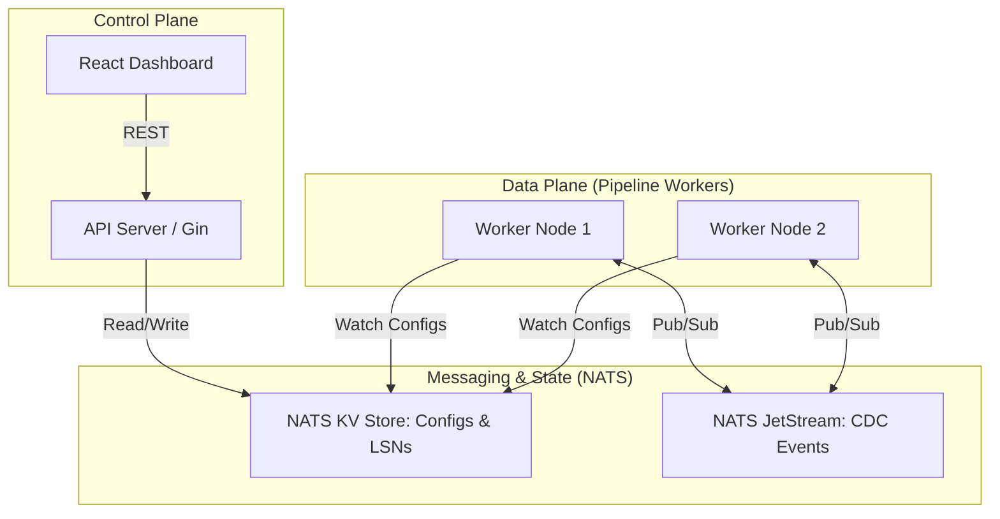
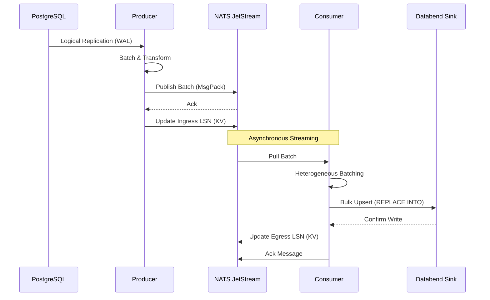
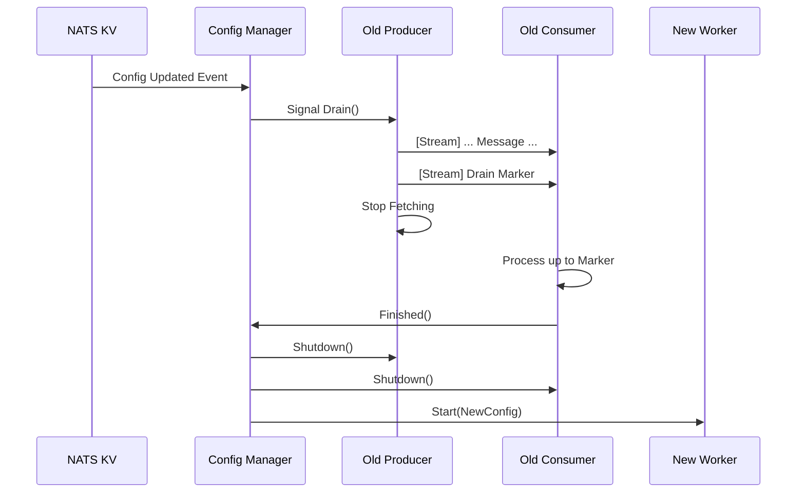

# RFC-001: CDC Data Pipeline Architecture & Design

> **Note for Confluence Users:** To import this document, use the **"Markdown Macro"** or the **"Import from Markdown"** feature. If Mermaid diagrams do not render automatically, ensure the **"Mermaid Charts"** or **"Mermaid.js"** plugin is enabled in your Confluence instance.

---

## Table of Contents
1.  [Objective & Background](#1-objective--background)
2.  [High-Level Architecture](#2-high-level-architecture)
    *   [2.1 Component Structure](#21-component-structure)
    *   [2.2 Data Lifecycle Flow](#22-data-lifecycle-flow)
    *   [2.3 Control Plane (API Server)](#23-control-plane-api-server)
    *   [2.4 Data Plane (Pipeline Worker)](#24-data-plane-pipeline-worker)
3.  [Configuration & Dynamic Reloading](#3-configuration--dynamic-reloading)
    *   [3.1 Hierarchical Configuration Model](#31-hierarchical-configuration-model)
    *   [3.2 Two-Phase Transition Protocol](#32-two-phase-transition-protocol)
4.  [Detailed Component Design](#4-detailed-component-design)
    *   [4.1 Pipeline Orchestration](#41-pipeline-orchestration)
    *   [4.2 Source (Ingress Layer)](#42-source-ingress-layer)
    *   [4.3 Producer (Ingress Orchestrator)](#43-producer-ingress-orchestrator)
    *   [4.4 Stream (Messaging Backbone)](#44-stream-messaging-backbone)
    *   [4.5 Transformers (Pre-processing)](#45-transformers-pre-processing)
    *   [4.6 Consumer (Egress Orchestrator)](#46-consumer-egress-orchestrator)
    *   [4.7 Sinks (Egress Layer)](#47-sinks-egress-layer)
5.  [Reliability & Self-Healing](#5-reliability--self-healing)
6.  [Retry Strategy & Trade-offs](#6-retry-strategy--trade-offs)
7.  [Multi-tenancy & Isolation](#7-multi-tenancy--isolation)
8.  [High Availability (HA)](#8-high-availability-ha)
9.  [Observability & Monitoring](#9-observability--monitoring)
10. [Security & Data Privacy](#10-security--data-privacy)
11. [Testing & Validation Strategy](#11-testing--validation-strategy)
12. [Resource Management & Limits](#12-resource-management--limits)
13. [Key Architectural Decisions & Trade-offs](#13-key-architectural-decisions--trade-offs)
14. [API Documentation](#14-api-documentation)
15. [Future Roadmap](#15-future-roadmap)
16. [Operational Runbook Snippets](#16-operational-runbook-snippets)
17. [Conclusion & Next Steps](#17-conclusion--next-steps)

---

## 1. Objective & Background
This RFC serves as a holistic architectural guide for the CDC Data Pipeline. It aims to document the current design, justify key technical decisions, and establish a roadmap for future development.

**Goal:** A high-performance (10k+ records/sec), modular, and reliable system to replicate data from PostgreSQL (Source) to analytical stores like Databend (Sink), with future support for unstructured sources (Google Drive) and additional sinks (S3, DuckDB, Snowflake).

---

## 2. High-Level Architecture
The system adopts a **"Control Plane vs. Data Plane"** separation of concerns, coordinated through **NATS JetStream**.

### **2.1. Component Structure**


### **2.2. Data Lifecycle Flow**


### **2.3. Control Plane (API Server)**
- **Role:** Manages pipeline configurations, user authentication, and health monitoring.
- **Tech Stack:** Go (Gin), JWT, SSE (for real-time dashboard updates).
- **Communication:** Directly interacts with NATS KV to store and broadcast configurations to the Data Plane.

### **2.4. Data Plane (Pipeline Worker)**
- **Role:** The "Stateful" engine that performs the actual data movement.
- **Design:** Each worker is an orchestrator managing independent `Pipeline` instances.
- **Lifecycle:** `Source -> Producer -> NATS JetStream -> Consumer -> Sink`.

---

## 3. Configuration & Dynamic Reloading
The system is designed for **Zero-Downtime Operations**, allowing engineers to update configurations (e.g., adding tables, changing batch sizes) without restarting the physical worker process.

### **3.1. Hierarchical Configuration Model**
The `ConfigManager` resolves configuration through a three-tier hierarchy:
1.  **Hardcoded Defaults:** Internal system constants (e.g., 5s batch wait).
2.  **Global Overrides:** Stored in `cdc.global.config` in NATS KV. Updating this triggers a rolling reload of *all* active pipelines.
3.  **Pipeline Overrides:** Stored in `cdc.pipeline.{id}.config`. These take the highest precedence and only trigger a reload for the specific pipeline.

### **3.2. Two-Phase Transition Protocol**
To ensure **LSN Consistency** and prevent data duplication or gaps during a reload, the system follows a strict transition sequence:

1.  **Phase 1: Drain (Soft Stop)**
    - The `ConfigManager` signals the active `Producer` to stop fetching new data.
    - The Producer emits a final `drain_marker` message into the NATS JetStream.
    - The `ConfigManager` waits for the `Consumer` to process all messages up to that marker.
2.  **Phase 2: Shutdown & Restart**
    - Once the Consumer finishes the drain, all database connections and NATS subscriptions are closed.
    - A new `Pipeline` instance is initialized with the updated configuration.
    - The new Producer fetches the last `IngressCheckpoint` and resumes streaming.



---

## 4. Detailed Component Design

### **4.1. Pipeline Orchestration**
The `Pipeline` struct is the top-level orchestrator for a single data stream.
- **Lifecycle Management:** It manages the `context.Context` for both Producer and Consumer, ensuring they start and stop in the correct sequence.
- **LSN Initialization:** On startup, the Pipeline fetches the latest `IngressCheckpoint` from NATS KV to determine where the Producer should resume.
- **Drain Marker Propagation:** Triggers a `Drain()`, causing the Producer to emit a final `drain_marker` message before stopping.

### **4.2. Source (Ingress Layer)**
The Ingress layer uses a **Plug-and-Play (PnP)** architecture via the `Source` interface.
- **PostgresSource:** Implementation using PostgreSQL logical replication (`pgoutput` plugin).
- **Logical Replication Slots:** It manages replication slots to ensure no WAL (Write-Ahead Log) is lost while the worker is offline.
- **Dynamic Table Discovery:** Periodically queries `information_schema.tables` to detect new tables matching the configured schemas.
- **Snapshots:** If starting from LSN 0, it performs an initial consistent snapshot using `SELECT` before switching to CDC mode.

### **4.3. Producer (Ingress Orchestrator)**
- **Ingress LSN Checkpointing:** After successfully publishing a batch to JetStream, it persists the highest LSN to NATS KV.
- **Circuit Breaker:** Uses `gobreaker` to wrap NATS publishing. If NATS becomes unreachable, the circuit opens, and the Producer stops pulling from the Source.

### **4.4. Stream (Messaging Backbone)**
**NATS JetStream** serves as the persistent messaging backbone.
- **Subjects:** Messages are published to subjects like `cdc_pipeline_{id}_ingest`.
- **Durability:** Streams are configured with `File` storage and `Replicas: 3` (in cluster mode) to ensure zero data loss.
- **Retention:** Uses a `Limits` based retention policy, allowing the Consumer to lag behind the Producer without losing data.

### **4.5. Transformers (Pre-processing)**
The system supports programmatic pre-processing through the `Transformer` interface.
- **Interface:** `Transform(ctx, message) -> (new_message, should_continue, error)`.
- **Chaining:** Multiple transformers can be chained (e.g., Masking -> Filtering -> Enrichment).
- **Built-in Logic:** Includes a `mask` transformer for SHA256 hashing of PII fields and a `filter` transformer for dropping records based on complex logic.

### **4.6. Consumer (Egress Orchestrator)**
- **Heterogeneous Batching:** Aggregates records into batches, grouped by `Table` and `Column Set`.
- **Isolation Mode (Poison Pill Detection):** If a batch upload fails repeatedly, the Consumer switches to single-message mode to identify the specific record causing the failure.
- **Dead Letter Queue (DLQ):** Failing records are routed to a dedicated NATS topic for manual inspection and remediation.

### **4.7. Sinks (Egress Layer)**
- **DatabendSink:** Uses `REPLACE INTO ... ON (pk) ...` for idempotent upserts.
- **Schema Evolution:**
    - **Policy:** The system automatically executes `ALTER TABLE ADD COLUMN` for new fields.
    - **Manual Intervention:** **Destructive changes** (DROP COLUMN, ALTER TYPE) are **blocked** and require manual SQL execution to prevent accidental data loss.

---

## 5. Reliability & Self-Healing
- **Autonomous Supervision:** Every worker node runs a supervisor goroutine that monitors for unexpected crashes.
- **Restart Policy:** If a worker crashes without an active `Transitioning` flag, the supervisor automatically triggers a restart with a 5-second stabilization delay.
- **LSN Safety:** By persisting checkpoints *after* success in the next stage, the system ensures at-least-once delivery even across worker crashes.

---

## 6. Retry Strategy & Trade-offs
The system implements a multi-layered retry strategy to handle transient failures and ensure data delivery.

### **6.1. Mechanism**
- **Exponential Backoff:** When a Sink upload fails, the Consumer calculates a backoff interval based on the `InitialInterval` and `MaxInterval`. It then `Nacks` (Negative Acknowledgment) the batch, allowing NATS JetStream to redeliver the messages after the backoff period.
- **Batch Isolation:** After a configurable number of failed attempts (`MaxRetries`), the Consumer switches from "Batch Mode" to **"Isolation Mode"**. In this mode, it processes each message in the failing batch individually to identify the specific record (poison pill) causing the error.
- **Circuit Breaker (Producer):** The Producer uses a circuit breaker for NATS publishing to prevent resource exhaustion during NATS outages.

### **6.2. Pros & Trade-offs**

| Category | Impact | Description |
| :--- | :--- | :--- |
| **Pros: Reliability** | **High** | Automatically recovers from transient network blips and temporary Sink unavailability. |
| **Pros: Automation** | **High** | Reduces the operational burden by handling "poison pill" records via the DLQ without human intervention. |
| **Trade-off: Duplicates** | **Medium** | "At-least-once" delivery combined with retries can result in duplicate message processing. **Mitigation:** Sinks (e.g., Databend) must implement idempotent `UPSERT/REPLACE` logic. |
| **Trade-off: Latency** | **Medium** | Exponential backoff significantly increases end-to-end latency during persistent failures. |
| **Trade-off: HOL Blocking** | **Low** | A single bad record can block the pipeline. **Mitigation:** The "Isolation Mode" minimizes the duration of this blocking by quickly identifying and moving the bad record to the DLQ. |

---

## 7. Multi-tenancy & Isolation
- **Organization Isolation:** Every NATS topic and KV key is prefixed with an `OrgID` (e.g., `org1.cdc.pipeline.id.config`).
- **NATS Multi-tenancy:** Leverages NATS Accounts/Users for strict security isolation between different organizations in a shared cluster.

---

## 8. High Availability (HA)
The system is built for **Production-Grade Availability**, using a distributed architecture to minimize downtime and ensure zero data loss.

### **8.1. Component Redundancy**
- **Control Plane (API):** The API server is stateless. Multiple instances can run behind a standard Load Balancer (e.g., K8s Service/Ingress). All instances share state through NATS KV.
- **Messaging Layer (NATS):** Deployed as a **NATS JetStream Cluster** with 3+ nodes. It uses the **Raft Consensus** algorithm to ensure configuration and message durability even if a node fails.
- **Data Plane (Workers):** 
    - **Current Model:** Stateful Singletons per pipeline. If a worker pod crashes, K8s automatically restarts it.
    - **Recovery:** Upon restart, the new worker instance fetches the latest **LSN Checkpoint** from NATS KV and resumes exactly where the previous instance left off (Hot-Standby Recovery).

### **8.2. Data Durability**
- **WAL Retention:** The PostgreSQL replication slot ensures that the source database retains WAL files until the Producer successfully acknowledges the publish to NATS.
- **JetStream Replication:** Streams are configured with `Replicas: 3`, ensuring that every CDC event is persisted on at least two out of three NATS nodes before being acknowledged to the Producer.

---

## 9. Observability & Monitoring
The system provides multi-layered monitoring to ensure engineers have full visibility into pipeline health and performance.

### **9.1. Prometheus Metrics**
The Data Plane exports a standard `/metrics` endpoint with the following key indicators:
- **`cdc_pipeline_records_synced_total`:** Total record count, segmented by `pipeline_id`, `source_id`, and `table`.
- **`cdc_pipeline_lag_milliseconds`:** The real-time delta between the source commit timestamp and the sink upload timestamp.
- **`cdc_pipeline_errors_total`:** Tracks failures in batch uploads and schema applications.
- **`cdc_pipeline_circuit_breaker_state`:** Monitors the health of the NATS publisher (0=Closed, 1=Open, 2=Half-Open).

### **9.2. Structured Logging**
- **Framework:** Uses **Zerolog** for high-speed, zero-allocation JSON logging.
- **Traceability:** Every log entry includes `pipeline_id`, `worker_id`, and `org_id` to allow for easy filtering in log aggregation tools like ELK or Grafana Loki.

### **9.3. Real-time Health Checks**
- **Worker Heartbeats:** Every Pipeline Worker periodically updates a `cdc.worker.{id}.heartbeat` key in NATS KV.
- **Status Dashboard:** The Control Plane monitors these heartbeats. If a heartbeat is older than 60 seconds, the pipeline is automatically marked as `Error` in the UI.
- **SSE Metrics:** Provides sub-second updates for LSN progress and per-table stats via Server-Sent Events.

---

## 10. Security & Data Privacy
The system implements multiple layers of security to protect both the infrastructure and the data being replicated.

### **10.1. Credential Encryption (At-Rest)**
All sensitive configurations (PostgreSQL passwords, Databend DSNs) are encrypted before being stored in NATS KV.
- **Algorithm:** AES-256-GCM (Galois/Counter Mode) for authenticated encryption.
- **Key Management:** Uses a 32-byte master key provided via the `ENCRYPTION_KEY` environment variable.
- **Prevention:** Ensures that even if NATS KV is compromised, source and sink credentials remain unreadable.

### **10.2. API Authentication & RBAC**
- **JWT (JSON Web Tokens):** The Control Plane is secured using RS256-signed JWTs.
- **Token Lifecycle:** Short-lived access tokens with a standard 15-minute expiration to minimize the window for token theft.
- **Organization Scoping:** Every request is scoped to an `OrgID`, ensuring users can only manage pipelines belonging to their organization.

### **10.3. PII Protection (In-Transit)**
- **Masking Transformer:** Programmatic pre-processing using the `mask` transformer allows hashing (SHA256) of sensitive fields (e.g., `email`, `ssn`) before they reach the analytical sink.
- **Filtering:** Prevents entire tables or rows containing sensitive data from ever leaving the source network.

---

## 11. Testing & Validation Strategy
To ensure reliability in production, the system undergoes rigorous automated testing.

### **11.1. Integration Testing (E2E)**
We use **Testcontainers-go** to spin up real instances of PostgreSQL, NATS, and Databend during the CI pipeline.
- **Scenario Testing:** Verifies end-to-end data flow for Initial Snapshots, CDC (`INSERT/UPDATE/DELETE`), and Schema Evolution.
- **Consistency Checks:** Automated tests compare the row count and payload hash between the source table and the sink table.
- **Eventually Assertions:** Uses `require.Eventually` to handle the asynchronous nature of NATS-based streaming.

### **11.2. Resilience & Chaos Testing**
- **Supervisor Validation:** Manually killing worker processes during an active sync to verify the supervisor's ability to restart and resume from the last LSN.
- **NATS Failover:** Testing how the Producer and Consumer react to transient NATS outages, ensuring the **Circuit Breaker** trips and prevents data loss in the source replication slot.

---

## 12. Resource Management & Limits
In a multi-tenant, high-throughput environment, resource management is critical to prevent OOMs and system saturation.

### **12.1. Throughput Control**
- **Batch Sizing:** Engineers can tune `BatchSize` and `BatchWait` per pipeline. This allows balancing between lower latency (smaller batches) and higher throughput (larger batches).
- **Memory Quotas:** The system uses zero-allocation serialization (MessagePack) to keep memory overhead low. Future iterations will include hard memory limits per worker pod.

### **12.2. Backpressure & Flow Control**
- **JetStream Limits:** NATS JetStream is configured with `MaxMsgs` and `MaxBytes` per stream. When the consumer is slow, NATS provides backpressure naturally.
- **Producer Circuit Breaker:** Prevents the system from attempting to publish to a saturated or failing messaging cluster, allowing the source database to retain data in its WAL logs until the system recovers.

---

## 13. Key Architectural Decisions & Trade-offs

| Decision | Choice | Why? | Pros | Cons |
| :--- | :--- | :--- | :--- | :--- |
| **Messaging** | **NATS JetStream** | Existing infra, one binary simplicity, built-in KV. | Lower operational overhead, extremely efficient. | Smaller ecosystem vs. Kafka. |
| **Serialization** | **MessagePack** | High-performance, zero-allocation requirements. | 5-10x faster than JSON, smaller payloads. | Not human-readable without tools. |
| **Scaling** | **Stateful Singleton** | Reduce complexity for the initial 1.0 release. | Easier to reason about consistency and LSN order. | Not natively HA (requires K8s restart). |
| **KV Consistency** | **Linearizable** | Guarantee that new workers see the absolute latest LSN. | Prevents data gaps during failovers. | Higher latency on writes (consensus requirement). |
| **Schema Evolution**| **Semi-Manual** | Prevent accidental data loss in analytical stores. | Safety first; engineers must approve destructive changes. | Slightly more friction for DDL changes. |

---

## 14. API Documentation
The Control Plane provides a RESTful API. All endpoints (except login) require `Bearer <JWT>`.

### **14.1. Pipelines**
| Method | Endpoint | Description |
| :--- | :--- | :--- |
| `GET` | `/pipelines` | List all pipelines with search and status filtering. |
| `POST` | `/pipelines` | Create a new pipeline configuration. |
| `GET` | `/pipelines/{id}/status` | Get real-time LSN status and table stats. |
| `POST` | `/pipelines/{id}/restart` | Manually trigger a pipeline reload/restart. |
| `GET` | `/pipelines/{id}/metrics` | SSE stream for real-time metrics updates. |

### **14.2. Sources & Sinks**
| Method | Endpoint | Description |
| :--- | :--- | :--- |
| `GET` | `/sources` | List all configured PostgreSQL sources. |
| `POST` | `/sources` | Register a new PostgreSQL source. |
| `GET` | `/sources/{id}/schema` | Trigger/Retrieve schema discovery for a source. |
| `GET` | `/sinks` | List all configured Databend sinks. |
| `POST` | `/sinks` | Register a new Databend sink. |

### **14.3. Global Configuration & Stats**
| Method | Endpoint | Description |
| :--- | :--- | :--- |
| `GET` | `/global` | Retrieve global batching and retry defaults. |
| `PUT` | `/global` | Update global defaults (triggers reload of all pipelines). |
| `GET` | `/stats/summary` | Retrieve aggregated totals (O(1) from cache). |

### **14.4. Error Handling**
- **`400 Bad Request`**: Validation failure (e.g., invalid JSON or missing fields).
- **`401 Unauthorized`**: Missing or invalid JWT token.
- **`429 Too Many Requests`**: Configuration lock (pipeline is already transitioning).
- **`500 Internal Error`**: NATS or database connectivity issues.

---

## 15. Future Roadmap
- **Sharding Strategy:** Transition from singletons to a "Distributed Worker Pool" using a consistent hashing ring.
- **New Sources:** Google Drive (Spreadsheets/PDFs) for unstructured-to-structured pipelines.
- **New Sinks:** Snowflake, S3 (Data Lake), and DuckDB for local analytics.

---

## 16. Operational Runbook Snippets
This section provides actionable CLI commands for on-call engineers to diagnose and manage the pipeline.

### **16.1. Diagnosing Lag & Throughput**
If the dashboard reports high lag, verify the state of the NATS JetStream consumer:
```bash
# List all streams to find the pipeline stream
nats stream list

# Get detailed info on the ingest consumer
nats consumer info cdc_pipeline_{id}_ingest {prefix}cdc_pipeline_{id}_ingest
```

### **16.2. Triggering a Manual Drain/Restart**
If a worker is stuck, trigger a manual reload:
```bash
curl -X POST http://cdc-api.internal/api/v1/pipelines/{id}/restart \
     -H "Authorization: Bearer <JWT_TOKEN>"
```

### **16.3. Verifying Worker Health via NATS KV**
Directly inspect the NATS KV store:
```bash
# Check worker heartbeat
nats kv get cdc-dp-config cdc.worker.{id}.heartbeat

# Check if a pipeline is in a transition lock
nats kv get cdc-dp-config cdc.pipeline.{id}.transition
```

### **16.4. Rotating the Encryption Key**
1.  **Preparation:** Read all `PrefixSourceConfig` and `PrefixSinkConfig` keys.
2.  **Re-encryption:** Decrypt with the `OLD_KEY`, encrypt with the `NEW_KEY`.
3.  **Deployment:** Update the `ENCRYPTION_KEY` env var and trigger a rolling restart.

---

## 17. Conclusion & Next Steps
We invite all engineers to review this architecture and provide feedback on the **Sharding Strategy** and **Multi-tenancy isolation**. Please use the GitHub Discussion/PR comments to voice concerns or suggestions.
